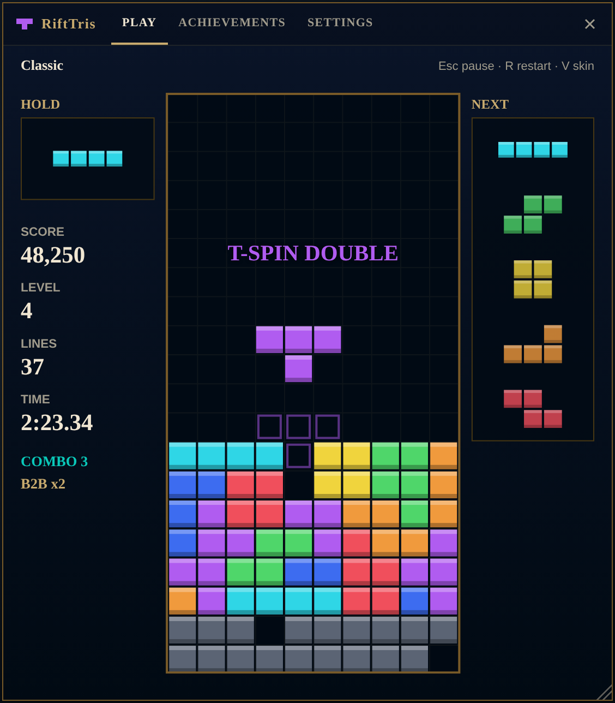
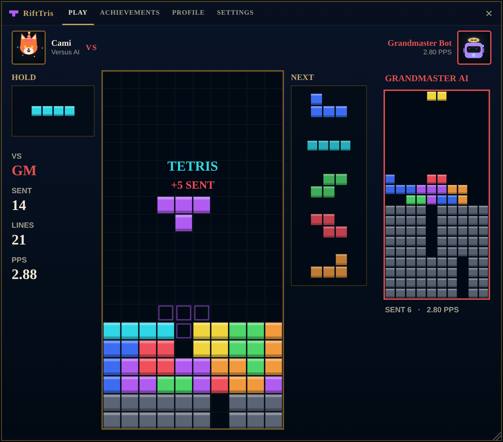
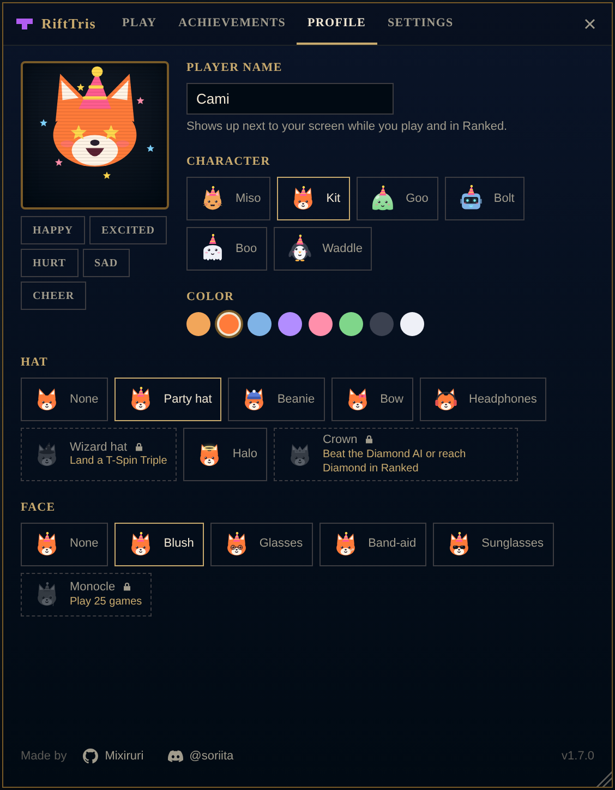
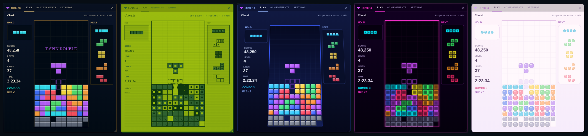
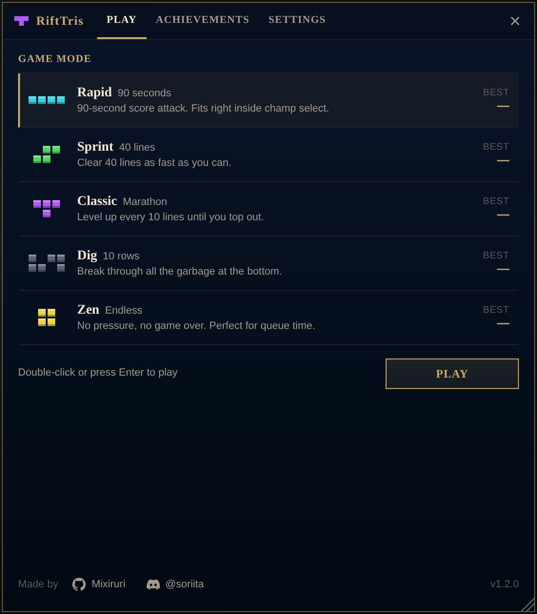

# RiftTris

**Modern Tetris inside the League of Legends client. Built for champ select.**

A [Pengu Loader](https://pengu.lol) plugin · 7 game modes · 42 achievements · playable characters · 5 skins · music & sound effects · zero setup

---

## Why?

Champ select lasts about 90 seconds and you spend most of it staring at a timer. **RiftTris** gives you a full Tetris game in a floating window inside the client. The **Rapid** mode lasts exactly 90 seconds, and the plugin pauses your game when it's your turn to ban or pick.

## Features

- **Modern Tetris engine:** SRS rotation with wall kicks, 7-bag randomizer, hold, 5-piece preview, ghost piece, lock delay, T-Spins (including minis), back-to-back, combos and Perfect Clears.
- **7 game modes:** a 90-second score attack, a 40-line sprint, a marathon, a garbage dig, a no-pressure zen mode, **Versus AI** and **Ranked Solo**.
- **Versus AI, ranked:** battle a bot on a second board. Clear lines to send garbage, and the first one to top out loses. The AI comes in 10 League ranks, from Iron (slow and sloppy) to Challenger (3.4 pieces per second, perfect placement). Pick any rank or hit **Climb** to fight the next one above yours. Each rank you beat unlocks its own achievement.
- **Ranked Solo (tryhard):** you have a fixed rank with LP. A win gives about +20 LP and a loss costs −18. At 100 LP you play a best-of-3 **promotion series** against the next tier's bot. Every tier has a demotion shield, and if you keep losing at 0 LP, or fall too far below even in a tier, you drop a tier. There are no restarts, and surrendering or closing the client mid-game counts as a loss.
- **Your own character:** set your player name and pick one of 6 original characters (cat, fox, slime, robot, ghost, penguin). You can change their color and give them a hat and a face accessory, and some of those unlock with achievements. They sit in a little screen next to your name while you play and react live: they cheer on line clears, go wild on Tetrises and T-Spins, flinch when garbage hits, sweat when your stack gets tall, and cry or celebrate at the end. In Versus, the bot gets its own screen too.
- **Champ select integration:**
  - The Tetris icon starts a Rapid game with one click.
  - The phase timer shows in the title bar.
  - The game pauses and a big alert shows up when it's your turn to ban or pick.
  - The window closes on its own when the match loads.
- **Floating, resizable window:** drag it by the title bar and resize it from the corner. The client stays visible and usable behind it, so you can still search for your champ while you play.
- **5 skins:** Hextech, Retro, 3D, Neon and Pastel. Each one restyles the board *and* the whole interface.
- **Background music:** the Tetris theme loops seamlessly in the background. The plugin finds the loop point in the track on its own, fades in smoothly and pauses together with the game. Want a different song? Swap `music.mp3` in the plugin folder for any track you like and the loop point is detected automatically.
- **Sound effects** for moves, rotations, line clears, T-Spins, combos (the pitch rises as the combo grows), level ups and the final countdown. Each skin has its own sound, and the Retro one is proper chiptune. Volume is adjustable and **M** mutes.
- **42 achievements** named after League moments (First Blood, Pentakill, Ace, Outplayed…), each with its own icon. When you unlock one, a Steam-style popup slides in at the bottom-right corner. You also get lifetime stats and your recent games.
- **Progress that sticks around:** records, achievements, settings and even unfinished games survive client restarts. You can move your save to another PC with a backup code.
- **Tunable handling:** DAS, ARR and soft drop speed, for people who take their Tetris seriously.

## Versus AI & Ranked Solo

Clear lines to send garbage to the bot, and the first one to top out loses. Every rank has its own bot, from Iron to Challenger, and both players get a little screen with their character reacting live.

## Your character

Pick a name, a character (cat, fox, slime, robot, ghost or penguin), a color, a hat and a face accessory. Locked items show exactly how to unlock them.

 

## Skins

| Skin | Look |
|---|---|
| **Hextech** | Gold and blue, matches the client |
| **Retro** | Four shades of green, pixel font and scanlines, like a Game Boy |
| **3D** | Extruded blocks on a tilted board |
| **Neon** | Glowing outlines on pure black |
| **Pastel** | Soft candy blocks on a light theme |

Switch skins in **Settings**, or press **V** at any time.

## Game modes

| Mode | Goal |
|---|---|
| **Rapid** | 90-second score attack. The speed goes up every 10 s. |
| **Sprint** | Clear 40 lines as fast as possible. |
| **Classic** | Marathon. You level up every 10 lines until you top out. |
| **Dig** | Clear 10 rows of garbage from the bottom of the board. |
| **Zen** | No game over. Good for waiting in queue. |
| **Versus AI** | Beat a bot on a second board. Pick any of the 10 ranks, from Iron to Challenger. |
| **Ranked Solo** | A fixed rank with LP, promotion series and demotions. |

Sprint, Classic, Dig and Zen autosave while you play, so you can close the client and continue later.

 

## Installation

1. Install [Pengu Loader](https://pengu.lol) if you don't have it yet.
2. Download `rifttris.zip` from the [latest release](../../releases/latest).
3. Extract it into your Pengu Loader `plugins` folder, so that you end up with `plugins/rifttris/index.js` and `plugins/rifttris/music.mp3`.
4. Restart the League client.
5. Click the **Tetris icon** in the bottom-right corner, or press **Alt+T** / **F8**.

## Controls

| Action | Keys |
|---|---|
| Move | `←` `→` |
| Soft drop / Hard drop | `↓` / `Space` |
| Rotate right / left / 180° | `↑` or `X` / `Z` or `Ctrl` / `A` |
| Hold | `C` or `Shift` |
| Pause · Restart | `Esc` or `P` · `R` |
| Change skin | `V` |
| Mute all sound | `M` |
| Open / close | `Alt+T` or `F8` |
| Quick start a mode | `1` – `7` |

When you click anywhere in the client, the game pauses and stops capturing your keyboard, so typing in the client is never blocked. Click the window to keep playing.

<b>All 42 achievements</b>

| Achievement | How to unlock |
|---|---|
| First Blood | Clear your first line |
| Tetris | Clear 4 lines at once |
| Pentakill | 5 Tetrises in a single game |
| Juke | Clear lines with a T-Spin |
| Flash + Ignite | Land a T-Spin Double |
| Outplayed | Land a T-Spin Triple |
| Ace | Perfect Clear the board |
| Killing Spree | Chain a 5 combo |
| Legendary | Chain a 10 combo |
| Snowball | 4 back-to-backs in a row |
| Fast Rotation | Sprint in under 2:00 |
| Challenger | Sprint in under 1:00 |
| No Flash | Finish Sprint without using Hold |
| Decent Farm | 10,000 points in Rapid |
| 10 CS per Minute | 30,000 points in Rapid |
| Multitasker | Finish a Rapid game during champ select |
| Mid Game | Reach level 10 in Classic |
| Late Game | Reach level 15 in Classic |
| Miner | Complete Dig |
| Mole | Complete Dig in under 45 s |
| Inner Peace | 100 lines in one Zen session |
| Veteran | 1,000 lines in total |
| Addicted | Play 25 games |
| Fill Player | Finish a game in every mode |
| Skin Collector | Finish a game with every skin |
| Out of Iron | Beat the Iron AI |
| Bronze Breaker | Beat the Bronze AI |
| Silver Lining | Beat the Silver AI |
| Gold Rush | Beat the Gold AI |
| Platinum Plated | Beat the Platinum AI |
| Emerald City | Beat the Emerald AI |
| Diamond Hands | Beat the Diamond AI |
| Master Class | Beat the Master AI |
| Grandmaster Flash | Beat the Grandmaster AI |
| Apex Predator | Beat the Challenger AI |
| Flawless Victory | Beat Gold or higher without taking a single garbage line |
| Placements Done | Win your first Ranked Solo game |
| Promoted | Win a promotion series |
| Clean Sweep | Win a promotion series 2-0 |
| Gold Standard | Reach Gold in Ranked Solo |
| Shine Bright | Reach Diamond in Ranked Solo |
| Top of the Ladder | Reach Challenger in Ranked Solo |

## Troubleshooting

- **Nothing happens when I click the icon.** Try **F8** or **Alt+T**. If that doesn't work either, open DevTools (`Ctrl+Shift+I`) and run `RiftTris.open()` in the console. Any error will show up there.
- **The window is off-screen.** Go to Settings → **Reset window size**.
- **A "duplicate install" notice showed up.** There's an older copy of the plugin in your `plugins` folder. Delete it and restart the client.

## Credits

Made by **Cami**

If you like it, a star on the repo helps a lot.

RiftTris isn't endorsed by Riot Games and doesn't reflect the views or opinions of Riot Games or anyone officially involved in producing or managing League of Legends. It's a purely visual client mod: it doesn't touch the game itself.
